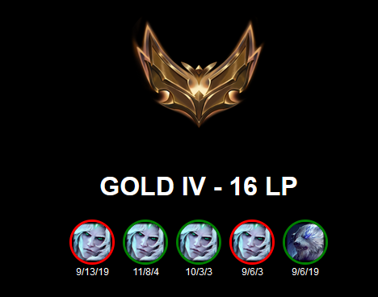
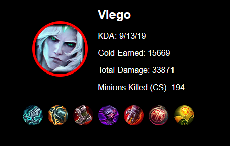

# League of Legends Rank Display für OBS

Dieses Projekt stellt ein web-basiertes Overlay bereit, das den Rang, LP und die letzten fünf Matches eines **League of Legends**-Spielers anzeigt. Es ist speziell für die Integration in **OBS** mit transparentem Hintergrund optimiert.

## Funktionen

- Zeigt den **aktuellen Rang**, **LP** und die **letzten 5 Spiele** eines Spielers.
- Zeigt die **Champion-Icons**, **KDA** und **Win/Loss-Status** der letzten Spiele an.
- Zwei Ansichtsmodi:
  - **Rang-Anzeige**: Zeigt den Rang und die letzten 5 Spiele.
  - **Detailansicht des letzten Spiels**: Zeigt detaillierte Informationen des letzten Matches, inklusive Gold, Schaden und Minions (CS).
- Aktualisiert die Daten alle 30 Sekunden automatisch.

## Vorschau

### Rang-Anzeige


### Detailansicht des letzten Spiels


## Installation und Verwendung

### Voraussetzungen

- Ein Webserver, der die Dateien hostet (z.B. Apache oder Nginx).
- Einen funktionierenden **Riot API Key**.

### Setup

1. **Repository klonen**:

   ```bash
   git clone https://github.com/dein-benutzername/lol-rank-display.git
   cd lol-rank-display
   ```

2. **API-Keys einrichten**:
   - Öffne die Datei `api.php` und füge deinen Riot API Key in die Variable `$apiKey` ein.

3. **Dateien hochladen**:
   - Lade die HTML- und PHP-Dateien auf deinen Webserver.

4. **Browser-URL aufrufen**:
   - Die URL sollte die Summoner-ID (Riot-ID) und die Tagline als Parameter enthalten. Beispiel:

   ```
   yourserver.com/index.html?riotIdName=SummonerName&tagline=1234
   ```

### API-Aufrufe und Funktion

#### index.html

Die Hauptseite lädt die Summoner-Daten basierend auf den Riot-ID- und Tagline-Parametern, die in der URL angegeben werden. Diese Daten werden von einem PHP-Skript (`api.php`) abgerufen, das die Riot API verwendet, um Summoner-Daten, Ränge und Match-Historien zu laden.

#### api.php

`api.php` ist das serverseitige Skript, das Daten von der Riot Games API abruft. Es verarbeitet folgende Schritte:

1. **Riot-ID und Tagline abfragen**: Die Riot-ID und die Tagline werden aus der URL entnommen und an die API übergeben.
2. **PUUID abrufen**: Über die Riot-ID und Tagline wird die PUUID des Spielers abgerufen.
3. **Summoner-Daten abrufen**: Mit der PUUID werden die Summoner-Daten und die Rang-Informationen abgerufen.
4. **Match-Historie laden**: Die letzten 5 Matches des Spielers werden abgerufen und analysiert.
5. **Letztes Match detailliert anzeigen**: Informationen zum letzten Match wie KDA, Gold, Schaden und Items werden geladen.

### Beispiel für eine API-URL

Rufe die folgende URL auf, um den Rang und die Match-Historie für den Summoner "SummonerName" mit der Tagline "1234" anzuzeigen:

```
yourserver.com/index.html?riotIdName=SummonerName&tagline=1234
```

### Dateien

- **index.html**: Frontend der Webanwendung, das die Daten des Spielers anzeigt.
- **api.php**: Backend-Logik, die die Riot Games API aufruft und die Daten verarbeitet.

### Fehlermeldungen

- **Riot ID or Tagline is missing**: Die Riot-ID oder Tagline wurde nicht übergeben.
- **Failed to retrieve account data or PUUID is missing**: Die Account-Daten konnten nicht abgerufen werden, möglicherweise ist die Region falsch oder die Riot API hat die Anfrage blockiert.
- **Failed to retrieve summoner data or summoner ID is missing**: Es konnten keine Summoner-Daten abgerufen werden.
- **Failed to retrieve rank data or rank data is missing**: Die Rangdaten konnten nicht abgerufen werden.

## Lizenz

Dieses Projekt ist unter der MIT-Lizenz lizenziert. Siehe die Datei [LICENSE](LICENSE) für Details.

---

**Viel Spaß mit dem League of Legends Rank Display für OBS!**
